# Knoboy

5\*5cm control pad with an encoder, runs [QMK firmware](https://github.com/myst729/qmk_firmware/tree/master/keyboards/dg/knoboy).

This is a POC project to prove my PCB design works, especially the encoder (knob) part. On the other hand, I want to practise my soldering skills before I could create some serious stuff. The next try would be making a mechanical keyboard that totally applies my personal preference, without a breakout board (bye bye [Pro Micro](https://github.com/sparkfun/Pro_Micro)).

## Tools

| Tool                              | Picture                    |
| --------------------------------- | -------------------------- |
| Soldering Iron (936)              | 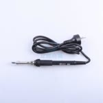 |
| Soldering Wire (Sn63/Pb37, 0.8mm) | 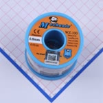 |
| Soldering Flux                    | 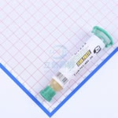 |

## Materials

| Material            | Label                                  | Quantity | Picture                                  |
| ------------------- | -------------------------------------- | -------- | ---------------------------------------- |
| ATmega32U4-AU       | U1                                     | 1        | 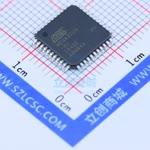  |
| 16MHz Crystal       | X1                                     | 1        | 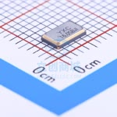  |
| Micro USB Connector | CN1                                    | 1        | 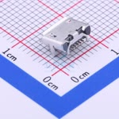      |
| 500mA Fuse          | F1                                     | 1        | 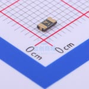     |
| 5mm LED             | LED1                                   | 1        | 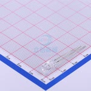        |
| 10KΩ Resistor       | R1                                     | 1        | 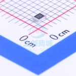  |
| 330Ω Resistor       | R2                                     | 1        | 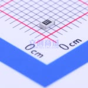  |
| 22Ω Resistor        | R3, R4                                 | 2        | 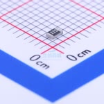   |
| 1uF Capacitor       | C1                                     | 1        | 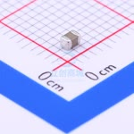  |
| 22pF Capacitor      | C2, C3                                 | 2        | 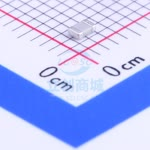 |
| 1N4148 Diode        | D1, D2, D3, D4, D5, D6, D7, D8, D9     | 9        | 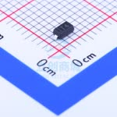   |
| 6x6x4.3 Switch      | SW1, SW2, SW3, SW4, SW5, SW6, SW7, SW8 | 8        | 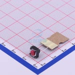 |
| EC11 Encoder        | SW9                                    | 1        | 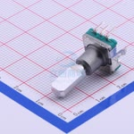   |
| 3x6x2.5 Switch      | SW10                                   | 1        | 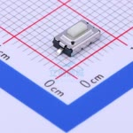 |

## Pictures

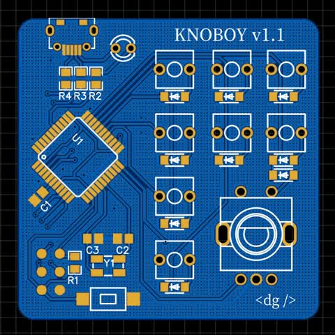

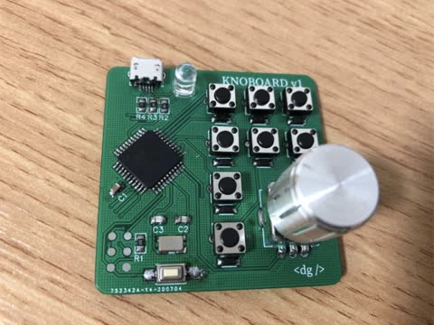
